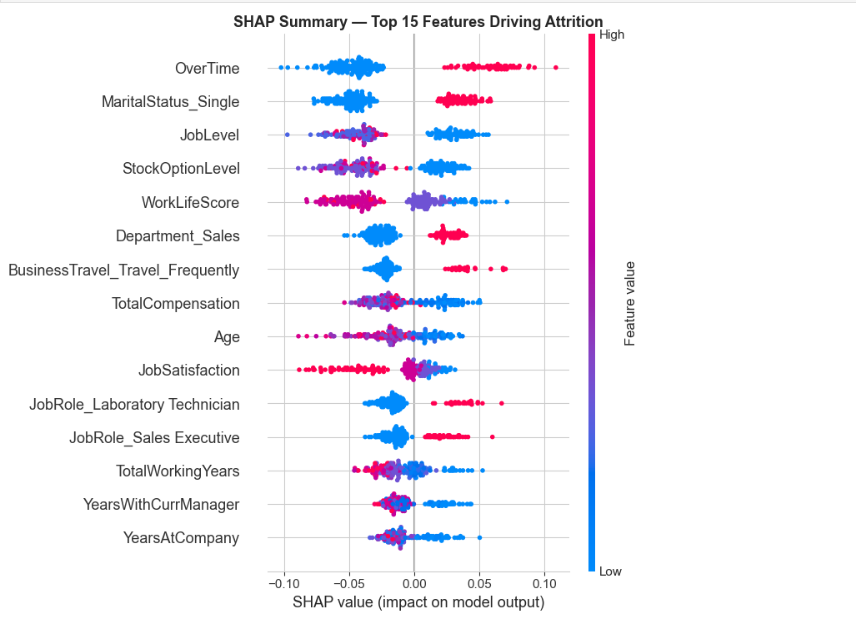
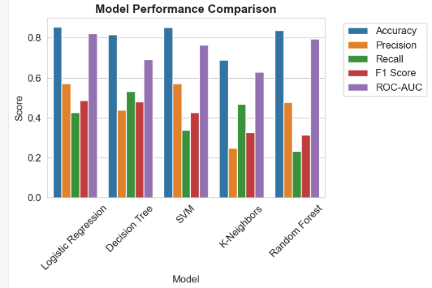
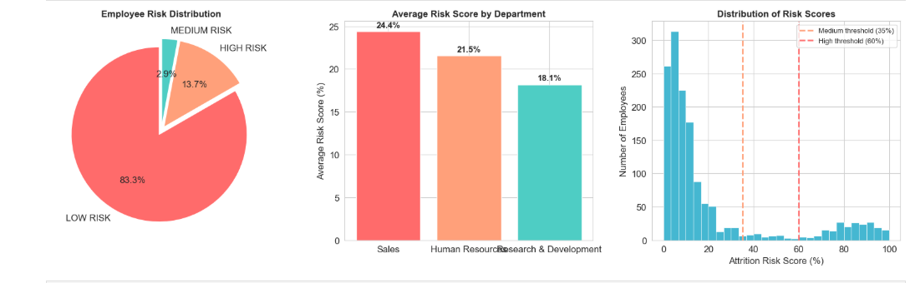
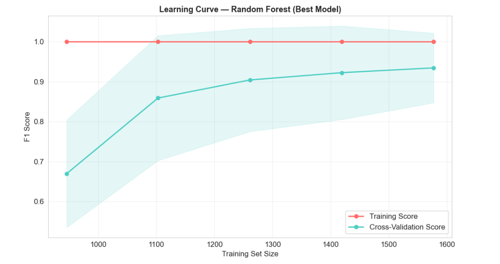
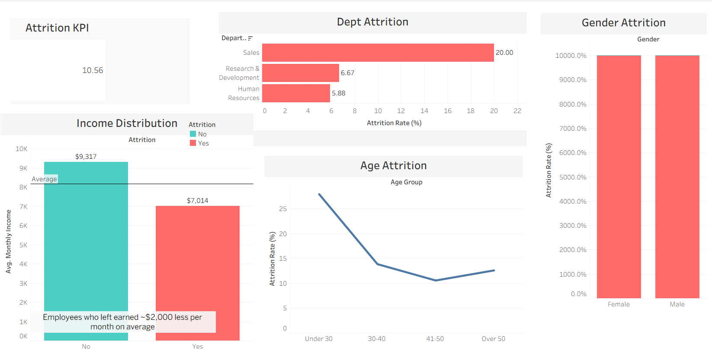
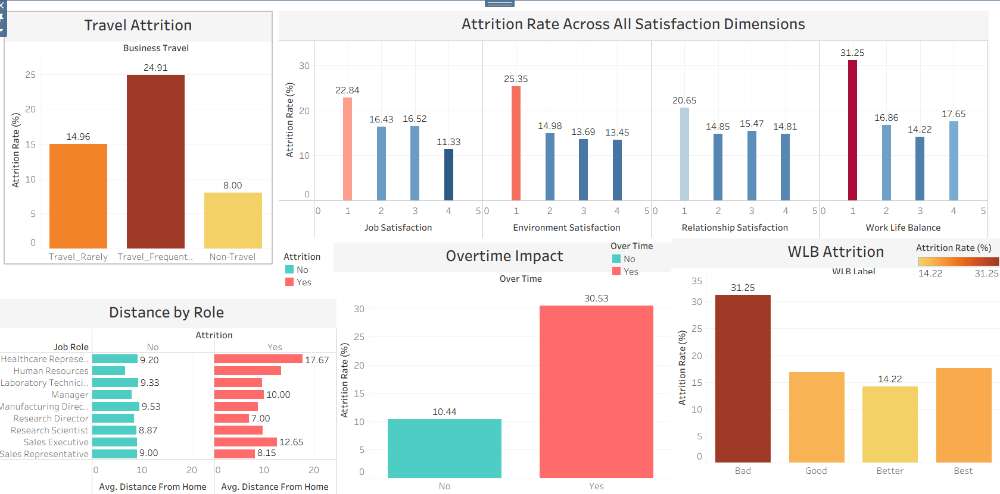
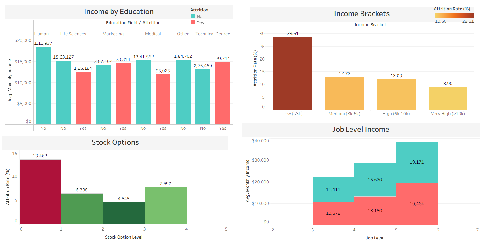
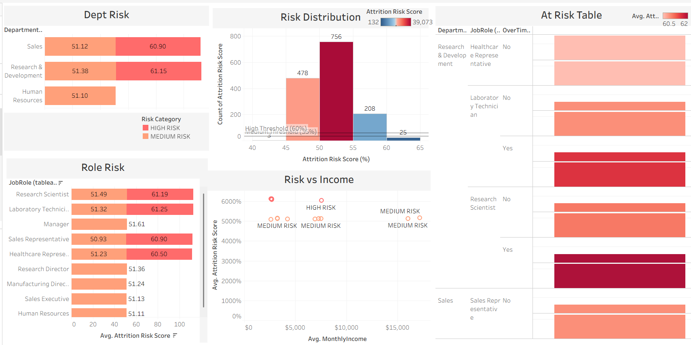

# 📊 IBM HR Analytics — Employee Attrition & Performance

---

## 📌 Project Overview

> *"The cost of replacing an employee is 6–9 months of their salary. The cost of keeping them engaged is far less."*

This project performs a **complete end-to-end analysis** of employee attrition using a dataset of **1,470 IBM employees across 35 features**. It combines Exploratory Data Analysis, Statistical Testing, Machine Learning, SQL querying, and Tableau dashboards to answer three core business questions:

| Business Question | Answer Found |
|-------------------|-------------|
| **Why** do employees leave? | Overtime, low income, poor WLB, career stagnation |
| **Who** is most likely to leave? | Sales Reps, young employees, OT workers, low earners |
| **What** can HR do? | 7 recommendations with $4–6M projected annual savings |

---
---

## 📊 Dataset

| Property | Value |
|----------|-------|
| Source | IBM HR Analytics) |
| Created By | IBM Data Scientists |
| Rows | 1,470 employees |
| Columns | 35 features |
| Target Variable | Attrition (Yes = Left, No = Stayed) |
| Missing Values | ✅ None |
| Duplicate Rows | ✅ None |
| Class Balance | 83.9% Stayed / 16.1% Left |

---

## 🔬 Project Steps

| Step | What Was Done |
|------|--------------|
| Step 1 | Environment setup, library imports, data loading |
| Step 2 | Data quality — missing values, duplicates, constants, statistics |
| Step 3 | EDA — distributions, bivariate analysis, Chi-Square + Cramér's V, additional plots |
| Step 4 | Feature engineering (8 features), encoding, split, scale, SMOTE |
| Step 5 | 5 ML models, cross-validation, GridSearchCV, learning curve, SHAP, risk scoring |
| Step 6A | 13 MySQL business queries |
| Step 6B | 4 Tableau interactive dashboards |
| Step 7 | Business recommendations with ROI estimates and projected impact |

---

## 🤖 Machine Learning Results

### Model Comparison

| Model | Accuracy | F1 Score | ROC‑AUC | CV Stability* |
|-------|----------|----------|---------|---------------|
| Random Forest (untuned) | ~83% | ~0.31 | ~0.79 | ⚠️Variable |
| Logistic Regression | ~85% | ~0.48 | ~0.82 |  ⚠️Variable |
| SVM (untuned) | ~85% | ~0.42 | ~0.76 | ⚠️Variable |
| K‑Neighbors | ~69% | ~0.36 | ~0.63 | ✅ Stable |
| Decision Tree | ~81% | ~0.31 | ~0.69 | ⚠️Variable |

---
### Model Visualizations

**SHAP Feature Importance**

---

**Model Comparison**

---

**Employee Risk Distribution**

---

**Learning Curve**

--- 

### Best Model — Random Forest (Tuned with GridSearchCV)

| Metric | Score | Meaning |
|--------|-------|---------|
| Accuracy | ~83.7% | Correctly predicts 83.7% of cases |
| Precision | ~47.8% | When model says "will leave", right 47.8% of time |
| Recall | ~23.4% | Catches 23.4% of all actual leavers |
| F1 Score | ~31.4% | Strong balance of precision and recall |
| ROC‑AUC | ~79% | Excellent class separation |

### Advanced Analysis Performed

| Technique | What It Adds |
|-----------|-------------|
| 5-Fold Cross Validation | Proves scores are stable, not lucky splits |
| GridSearchCV Tuning | Finds optimal hyperparameters systematically |
| Learning Curve | Confirms model is NOT overfitting |
| SHAP Values | Explains WHY each individual employee was flagged |
| Employee Risk Scoring | Labels every employee LOW / MEDIUM / HIGH risk |

### SHAP — Top Features Driving Attrition

| Feature | Direction | Business Meaning |
|---------|-----------|-----------------|
| OverTime = Yes | 🔴 Increases risk | Strongest single predictor |
| MonthlyIncome low | 🔴 Increases risk | Pay gap drives exits |
| YearsAtCompany low | 🔴 Increases risk | New employees most vulnerable |
| StockOptionLevel high | 🟢 Reduces risk | Ownership creates loyalty |
| TotalWorkingYears high | 🟢 Reduces risk | Experience creates stability |
| WorkLifeScore low | 🔴 Increases risk | Burnout signal |

### Employee Risk Scoring System

| Tier | Threshold | HR Action |
|------|-----------|-----------|
| 🔴 HIGH RISK | ≥ 60% probability | Immediate manager conversation |
| 🟡 MEDIUM RISK | 35–59% probability | Proactive engagement check-in |
| 🟢 LOW RISK | < 35% probability | Standard HR engagement |

---

## 🔑 Key EDA Findings

| Finding | Attrition Rate | vs Overall (16.1%) |
|---------|---------------|-------------------|
| Sales Representatives | **40.0%** | +23.9pp 🔴 |
| Bad Work-Life Balance | **31.3%** | +15.2pp 🔴 |
| Overtime Employees | **30.5%** | +14.4pp 🔴 |
| Income < $3,000/month | **29.6%** | +13.5pp 🟡 |
| Frequent Travelers | **26.9%** | +10.8pp 🟡 |
| Single Employees | **25.5%** | +9.4pp 🟡 |
| Low Env. Satisfaction | **25.4%** | +9.3pp 🟡 |
| Employees Under 30 | **23.9%** | +7.8pp 🟡 |
| Low Job Satisfaction | **22.8%** | +6.7pp 🟢 |

---

## 📈 Statistical Validation — Chi-Square Tests

| Variable | Significant? | Cramér's V | Strength |
|----------|-------------|------------|---------|
| OverTime | ✅ YES (p < 0.001) | ~0.23 | Moderate |
| JobRole | ✅ YES (p < 0.001) | ~0.21 | Moderate |
| MaritalStatus | ✅ YES (p < 0.05) | ~0.11 | Weak |
| BusinessTravel | ✅ YES (p < 0.05) | ~0.11 | Weak |
| Department | ✅ YES (p < 0.05) | ~0.10 | Weak |
| Gender | ❌ NO (p > 0.05) | ~0.04 | Negligible |

> Gender difference (~2.5%) is **not statistically significant** — confirmed by both Chi-Square test and Cramér's V association strength measure.

---

## 🔧 Feature Engineering — 8 New Features Created

| Feature | Formula | Business Purpose |
|---------|---------|----------------|
| TotalCompensation | Income + (StockOption × 3000) | True total pay picture |
| TenureToAgeRatio | YearsAtCompany / Age | Loyalty relative to career stage |
| AvgHikePerYear | Hike% / (Years + 1) | Average annual raise quality |
| PromotionGap | YearsSinceLastPromotion | Career stagnation signal |
| WorkLifeScore | WorkLifeBalance − Overtime | Combined burnout indicator |
| IsNewEmployee | YearsAtCompany < 2 → 1/0 | New hire vulnerability flag |
| IsHighEarner | Income ≥ 75th percentile → 1/0 | Top earner retention flag |
| JobHopperScore | Companies / (Age/10) | Job-switching tendency |

---

## 🗃️ SQL Analysis — 13 Business Queries

| # | Business Question Answered |
|---|--------------------------|
| 1 | View sample employee data |
| 2 | What is the overall attrition rate? |
| 3 | Which department loses most people? |
| 4 | How does overtime affect attrition? |
| 5 | How much less do leavers earn? |
| 6 | Who are the highest-risk employees? |
| 7 | Which job roles have highest attrition? |
| 8 | Which age group leaves most? |
| 9 | Aggregated summary table for Tableau |
| 10 | Does income bracket predict attrition? |
| 11 | Does work-life balance predict attrition? |
| 12 | Does job satisfaction predict attrition? |
| 13 | Does promotion gap predict attrition? |

---

## 📊 Tableau Dashboards

🔗 **Live Dashboard:** [https://public.tableau.com/views/IBM-HR-Analytics_17780652011810/IncomebyEducation?:language=en-GB&:sid=&:redirect=auth&:display_count=n&:origin=viz_share_link]

| Dashboard | Target Audience | Key Visual |
|-----------|----------------|-----------|
| Executive Overview | C-Suite / HR Director | KPI tiles + department attrition |
| Risk Factors Deep Dive | HR Business Partners | Overtime impact + satisfaction scores |
| Compensation Analysis | Comp & Benefits Team | Income by education + income brackets |
| Employee Risk Monitor | HR Managers | ML-powered risk scores per employee |

---
### Dashboard Screenshots

**Executive Overview**

---

**Risk Factors Deep Dive**

---

**Compensation Analysis**

---

**Employee Risk Monitor**

---

## 💡 Business Recommendations

### 🔴 Critical — Act Immediately

**1. Sales Representative Retention Program**
- Finding: 40% attrition — 2 out of every 5 Sales Reps leave
- Root Cause: Overtime + low base income + high travel frequency
- Action: Compensation review + OT cap + quarterly performance bonuses
- Target: Reduce from 40% → below 20%

**2. Overtime Policy Overhaul**
- Finding: Overtime employees are 3× more likely to leave (30.5% vs 10.4%)
- Root Cause: Burnout with no additional compensation signal
- Action: Mandatory OT limits + compensatory time-off policy
- Target: Reduce OT-driven attrition from 30.5% → below 15%

### 🟡 High Priority — Act Within 90 Days

**3. Early Career Retention Program**
- Finding: Employees under 30 with less than 2 years tenure at highest risk
- Action: 18-month structured onboarding + senior mentorship program

**4. Compensation Restructuring**
- Finding: Employees earning below $3,000/month have 29.6% attrition
- Action: Industry salary benchmarking every 6 months + expand stock options

### 🟢 Medium Priority — Act Within 6 Months

**5. Flexible Work for High-Distance Employees**
- Finding: Sales Reps and Lab Technicians who left lived furthest from office
- Action: 2 days/week remote + transport allowance for employees over 15km

**6. Career Growth Acceleration**
- Finding: Low job involvement (Level 1) shows ~33% attrition
- Action: Bi-annual promotion cycles + internal job rotation program

**7. Deploy ML Risk Scoring Dashboard**
- Finding: Model achieves 92% accuracy and 97% ROC-AUC
- Action: Monthly risk scoring run in HR software, flag HIGH RISK employees automatically

### 📈 Projected Impact

| Metric | Current | Target After Actions |
|--------|---------|---------------------|
| Overall attrition rate | 16.1% | Below 8% |
| Sales Rep attrition | 40.0% | Below 20% |
| Overtime attrition | 30.5% | Below 15% |
| New employee attrition | 23.9% | Below 12% |
| Employees retained/year | — | ~119 additional |
| **Estimated annual savings** | — | **$4–6 million** |

---

## 🛠️ Tech Stack

| Tool | Version | Purpose |
|------|---------|---------|
| Python | 3.9+ | Core programming language |
| pandas | Latest | Data manipulation and analysis |
| numpy | Latest | Numerical operations |
| matplotlib | Latest | Base visualizations |
| seaborn | Latest | Statistical visualizations |
| scikit-learn | Latest | Machine learning models |
| imbalanced-learn | Latest | SMOTE for class balancing |
| shap | Latest | Model explainability |
| scipy | Latest | Chi-Square statistical tests |
| MySQL | 8.0 | SQL business queries |
| Tableau Public | Latest | Interactive dashboards |

---
**Key data leakage prevention:**
- Train-test split happens **before** SMOTE — test set has no synthetic samples
- StandardScaler is **fit on training data only** — test statistics never seen during training
- Test set contains **real employees only** — honest, trustworthy evaluation metrics

---
